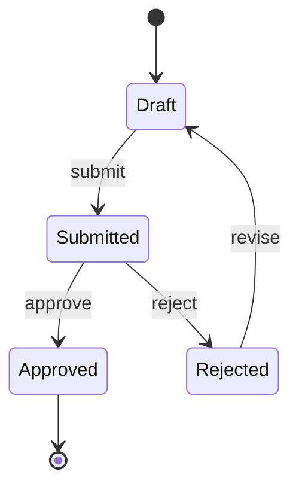

# Phase 3: Technical Architecture

**Make technology decisions that fit YOUR product.**

Load this AFTER completing all Bounded Context Canvases (Phase 2C).

---

## WHAT YOU'RE DOING

Making technology decisions: stack, infrastructure, data architecture, state machines. Plus: validating high-risk assumptions through prototyping.

**Critical Rule:** Let Phase 1 + 2 drive Phase 3. Your PRD defines WHAT, your domain model defines HOW it's organized. The tech stack should fit THAT.

---

## THE DECISION FRAMEWORK

Before adding ANY complexity, ask three questions:

### Question 1: Do I Have This Problem RIGHT NOW?

**YAGNI Principle (You Aren't Gonna Need It)**

Don't build for hypothetical future scale.

| Bad Reasoning | Good Reasoning |
|---------------|----------------|
| "We might need 1M users someday" | "We have 100 users, monolith works" |
| "Microservices are best practice" | "Solo founder, keep it simple" |
| "Kubernetes is what big companies use" | "Managed hosting handles everything" |

### Question 2: Does My ICP Require This at Signing?

| Selling To | Need | Don't Need |
|------------|------|------------|
| Consumers (B2C) | Fast UX, simple auth | SAML SSO, audit logs |
| SMBs | Multi-tenancy, affordability | Complex compliance |
| Enterprise | SAML SSO, audit logs, SOC 2 | Nothing—these are table stakes |

### Question 3: What's the Cost of Adding This Later?

| Decision | Retrofit Cost | When to Consider |
|----------|---------------|------------------|
| Multi-tenancy | 3-6 months | If B2B, design now |
| Database schema | High risk | Get it right now |
| Enterprise auth (SAML) | 2-3 months | If ICP is enterprise |
| Real-time architecture | 1-2 months | If Phase 2 shows need |

| Decision | Retrofit Cost | When to Add |
|----------|---------------|-------------|
| Custom analytics | 1-2 weeks | When built-in insufficient |
| Advanced caching | 1 week | When performance is problem |
| Admin dashboard | 1-2 weeks | When manual queries annoying |

**Rule:** Retrofit > 1 month → consider now. Retrofit < 1 week → defer.

---

## STEP 1: STACK DECISIONS

For each category, document your choice with rationale.

### Template

```markdown
## Stack Decisions

### Frontend: [Choice]
**What it is:** [Plain English]
**Why it fits:** [Connect to your PRD]
**Alternatives considered:** [What else, why not]

### Backend: [Choice]
**What it is:** [Plain English]
**Why it fits:** [Connect to your PRD]
**Alternatives considered:** [What else, why not]

### Database: [Choice]
**What it is:** [Plain English]
**Why it fits:** [Connect to your PRD]
**Alternatives considered:** [What else, why not]

### Authentication: [Choice]
**What it is:** [Plain English]
**Why it fits:** [Connect to your PRD]
**Alternatives considered:** [What else, why not]

### Hosting: [Choice]
**What it is:** [Plain English]
**Why it fits:** [Connect to your PRD]
**Alternatives considered:** [What else, why not]
```

### [AI-POWERED] Additional Stack Decisions

```markdown
### LLM Provider: [Choice]
**What it is:** [Plain English]
**Why it fits:** [Cost, capabilities, latency needs]
**Alternatives considered:** [What else, why not]

### AI Infrastructure: [Choice]
**What it is:** [Direct API / Vercel AI SDK / LangChain / etc.]
**Why it fits:** [Complexity level needed]
```

---

## STEP 2: INFRASTRUCTURE

### Architecture Pattern

| Pattern | When to Use |
|---------|-------------|
| **Monolith** (default) | Solo vibe coder, simple product, no specific reason for complexity |
| **Modular Monolith** | Want clear internal boundaries, might split later |
| **Microservices** | Different SLAs per service, team boundaries, specific justification |

### Infrastructure Diagram

Draw your components and connections:

```
┌─────────────────┐     ┌─────────────────┐
│    Frontend     │────▶│    Backend      │
│   (Vercel)      │     │   (Railway)     │
└─────────────────┘     └────────┬────────┘
                                 │
                    ┌────────────┼────────────┐
                    │            │            │
                    ▼            ▼            ▼
            ┌───────────┐ ┌───────────┐ ┌───────────┐
            │  Database │ │    Auth   │ │  LLM API  │
            │ (Supabase)│ │  (Auth0)  │ │ (Claude)  │
            └───────────┘ └───────────┘ └───────────┘
```

---

## STEP 3: DATA ARCHITECTURE

Map every entity from Phase 2 Bounded Context Canvases to storage.

### Template

```markdown
## Data Architecture

### [Entity Name]
**From context:** [Which bounded context]
**Storage:** [Database table/collection]
**Key fields:** [List]
**Relationships:** [Foreign keys]
**Indexes needed:** [For common queries]
```

### Multi-Tenancy (If B2B)

Default approach: Shared database with tenant_id

```sql
-- Every table has tenant_id
CREATE TABLE orders (
  id UUID PRIMARY KEY,
  tenant_id UUID NOT NULL REFERENCES tenants(id),
  -- other fields
);

-- Row-Level Security enforces isolation
CREATE POLICY tenant_isolation ON orders
  USING (tenant_id = current_setting('app.current_tenant')::uuid);
```

---

## STEP 4: STATE MACHINES

For every stateful entity from Phase 2.

### Identify Stateful Entities

Look for:
- Status fields (pending, active, completed)
- Lifecycle stages (draft → published → archived)
- Approval workflows (submitted → approved → rejected)

### Template

```markdown
## State Machine: [Entity]

**States:** [List all]
**Initial state:** [Where it starts]
**Terminal states:** [Where it ends]

### Transitions

| From | To | Trigger | Guard Condition | Action |
|------|-----|---------|-----------------|--------|
| draft | submitted | user submits | all required fields filled | notify reviewer |
| submitted | approved | reviewer approves | has permission | notify author |
```

### Mermaid Diagram



---

## STEP 5: RISK PROTOTYPING (2-4 Hours)

Before finalizing, prototype high-risk components from your Phase 1 Technical Risks section.

### What to Prototype

- **Authentication** (if security-critical)
- **Payments** (if taking money)
- **AI/LLM features** (if using APIs with costs/limits)
- **Real-time features** (if latency matters)

### Prototype Template

```markdown
## Risk Prototype: [Component]

**What I tested:** [One sentence]
**What I built:** [Brief description]
**Time spent:** [X minutes]

**Results:**
- Did it work? [Yes/No/Partially]
- Surprises: [List]
- Costs/limits discovered: [If applicable]

**Impact on architecture:**
- [ ] No changes needed
- [ ] Minor adjustment: [describe]
- [ ] Major change required: [describe]
```

### When to Skip

- Component is well-understood (basic CRUD)
- You've built it before
- Generic subdomain with proven libraries
- No third-party dependencies

**When in doubt, prototype.** 2 hours now saves 2 weeks later.

---

## [AI-POWERED] ADDITIONAL CONSIDERATIONS

### Required Components

| Component | Purpose |
|-----------|---------|
| LLM Provider | Claude, OpenAI, etc. |
| Streaming | Real-time response display |
| Token tracking | Monitor costs per user |
| Rate limiting | Prevent abuse |
| Fallbacks | What happens when API down |

### Database Schema Additions

```sql
-- Track AI usage for cost control
CREATE TABLE ai_usage_logs (
  id UUID PRIMARY KEY,
  user_id UUID REFERENCES users(id),
  tokens_in INTEGER,
  tokens_out INTEGER,
  cost_usd DECIMAL(10,6),
  created_at TIMESTAMP DEFAULT NOW()
);

-- Store conversation history
CREATE TABLE conversations (
  id UUID PRIMARY KEY,
  user_id UUID REFERENCES users(id),
  messages JSONB,
  created_at TIMESTAMP DEFAULT NOW()
);
```

### Framework Selection

| Need | Use |
|------|-----|
| Simple chat, Q&A | Direct API calls |
| Streaming, multi-provider | Vercel AI SDK |
| Document retrieval (RAG) | LlamaIndex |
| Complex multi-step workflows | LangChain |

**Rule:** Start simple. Graduate to frameworks when you have the specific use case.

---

## TECHNICAL ARCHITECTURE DOCUMENT

Combine all the above into one document:

```markdown
# Technical Architecture: [Product Name]

## Stack Decisions
[From Step 1]

## Infrastructure Diagram
[From Step 2]

## Data Architecture
[From Step 3]

## State Machines
[From Step 4]

## Risk Prototypes
[From Step 5]

## [AI-POWERED] AI Infrastructure
[If applicable]
```

---

## COMPLETION CHECKLIST

Do NOT proceed to Phase 4 until ALL checked:

**Stack & Infrastructure**
- [ ] Stack decisions documented with rationale
- [ ] Applied 3-question framework to each decision
- [ ] Infrastructure diagram shows all components
- [ ] Architecture pattern chosen (monolith/modular/microservices)

**Data Architecture**
- [ ] Every entity from Phase 2 has storage home
- [ ] Schemas defined (tables, fields, relationships)
- [ ] Multi-tenancy designed (if B2B)
- [ ] Key queries identified with indexes

**State Machines**
- [ ] All stateful entities identified
- [ ] State machines formally defined
- [ ] Mermaid diagrams created
- [ ] Transitions have triggers and guards

**Risk Validation**
- [ ] High-risk components from Phase 1 prototyped
- [ ] Prototype results documented
- [ ] Architecture adjusted based on learnings
- [ ] No deal-breakers found

---

## NEXT STEP

"Technical Architecture complete. Now create rules to enforce it. Load Phase 4 rules documentation."
